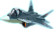

# PLANE SHOOTER
- Thử nghiệm game
# Giới thiệu game
Plane Shooter là một tựa game bắn máy bay kinh diển. Bạn sẽ đắm chìm vào những cuộc chiến đấu máy bay hấp dẫn. Hãy điều khiển máy bay thật khéo léo để có thể tiêu diệt được nhiều máy bay địch nhất và ghi tên mình lên bảng xếp hạng. 
- [0. Cách tải game](#0-cách-tải-game)
    * [a. Cách 1: Không bao gồm code.](#a-cách-1-không-bao-gồm-code)
    * [b. Cách 2: Bao gồm code và có thể biên dịch](#b-cách-2-bao-gồm-code-và-có-thể-biên-dịch)
- [1. Các thành phần game](#1-các-thành-phần-game)
    * [a. Máy bay](#a-máy-bay)
    * [b. Kĩ năng](#b-kĩ-năng)
- [2. Cách chơi](#1-cách-chơi)
    * [a. Menu](#a-menu)
    * [b. Di chuyển máy bay và bắn đạn](#b-di-chuyển-máy-bay-và-bắn-đạn)
    * [c. Sử dụng các kĩ năng](#c-sử-dụng-các-kĩ-năng)
    * [d. Pause game](#d-pause-game)
    * [e. End game](#e-end-game)
# 0. Cách tải game
   Cài Visual Studio 2022 : [https://www.youtube.com/watch?v=hto2TVEhNkA]  
   Cài các thư viện SDL cho VS2022 :  
   SDL: [https://lazyfoo.net/tutorials/SDL/01_hello_SDL/windows/msvc2019/index.php]  
   SDL_image: [https://lazyfoo.net/tutorials/SDL/06_extension_libraries_and_loading_other_image_formats/windows/msvc2019/index.php]  
   SDL_mixer: [https://github.com/libsdl-org/SDL_mixer/releases]  
   SDL_ttf: [https://github.com/libsdl-org/SDL_ttf/releases]  
##  a. Cách 1: Không bao gồm code.
   Tải tại link sau: [https://github.com/bthdz/plane-shoot/releases/tag/bth]
## b. Cách 2: Bao gồm code và có thể biên dịch  
### Bước 1. Clone repo này về hoặc chọn Code -> Download Zip.  
### Bước 2. Cài các thư viện như hướng dẫn ở trên.
### Bước 3. Mở file learn.exe và chơi.  

# 1. Các thành phần game
## a. Máy bay  
- 3 loại máy bay:
       
  
  
  
  
    
## b. Kĩ năng  
- Skill1: tạo khiên chắn không bị va chạm với đạn và địch

  

- Skill2: dùng tia sét để tiêu diệt toàn bộ máy bay địch

  

- Skill3: hồi máu +50hp  

  

# 2. Cách chơi

