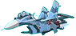

# PLANE SHOOTER
- Ý tưởng: Phát triển phần mềm 123A-Z  [https://phattrienphanmem123az.com/lap-trinh-game-cpp/page/2]
- Phát triển thêm: Các kĩ năng và tạo thanh máu cho máy bay
- Thử nghiệm game [https://www.youtube.com/@user-xy8nu2qv9y/featured]
# Giới thiệu game
Plane Shooter là một tựa game bắn máy bay kinh diển. Bạn sẽ đắm chìm vào những cuộc chiến đấu máy bay hấp dẫn. Hãy điều khiển máy bay thật khéo léo để có thể tiêu diệt được nhiều máy bay địch nhất và ghi tên mình lên bảng xếp hạng. 
- [0. Cách tải game](#0-cách-tải-game)
    * [a. Cách 1: Không bao gồm code.](#a-cách-1-không-bao-gồm-code)
    * [b. Cách 2: Bao gồm code và có thể biên dịch](#b-cách-2-bao-gồm-code-và-có-thể-biên-dịch)
- [1. Các thành phần game](#1-các-thành-phần-game)
    * [a. Máy bay](#a-máy-bay)
    * [b. Kĩ năng](#b-kĩ-năng)
- [2. Cách chơi](#1-cách-chơi)
    * [a. Menu](#a-menu)
    * [b. Di chuyển máy bay và bắn đạn](#b-di-chuyển-máy-bay-và-bắn-đạn)
    * [c. Sử dụng các kĩ năng](#c-sử-dụng-các-kĩ-năng)
    * [d. Pause game](#d-pause-game)
    * [e. End game](#e-end-game)
- [3. Về Source Code](#3-về-source-code)
# 0. Cách tải game
   Cài Visual Studio 2022 : [https://www.youtube.com/watch?v=hto2TVEhNkA]  
   Cài các thư viện SDL cho VS2022 :  
   SDL: [https://lazyfoo.net/tutorials/SDL/01_hello_SDL/windows/msvc2019/index.php]  
   SDL_image: [https://lazyfoo.net/tutorials/SDL/06_extension_libraries_and_loading_other_image_formats/windows/msvc2019/index.php]  
   SDL_mixer: [https://github.com/libsdl-org/SDL_mixer/releases]  
   SDL_ttf: [https://github.com/libsdl-org/SDL_ttf/releases]  
##  a. Cách 1: Không bao gồm code.
   Tải tại link sau: [[https://github.com/bthdz/plane-shoot/releases/tag/bth](https://github.com/bthdz/plane-shoot/releases/tag/bth)]
## b. Cách 2: Bao gồm code và có thể biên dịch  
### Bước 1. Clone repo này về hoặc chọn Code -> Download Zip.  
### Bước 2. Cài visual studio và các thư viện như hướng dẫn ở trên.
### Bước 3. Mở learn.sln chuyển về x86 và chạy chương trình.  

# 1. Các thành phần game
## a. Máy bay  
- 3 loại máy bay địch có thể bắn đạn theo đường thẳng:
       
  
  
  
  
  
  
## b. Kĩ năng  
- Skill1: tạo khiên chắn không bị va chạm với đạn và địch

  

- Skill2: dùng tia sét để tiêu diệt toàn bộ máy bay địch

  

- Skill3: hồi máu +50hp  

  

# 2. Cách chơi  
## a. Menu
- Chọn start để bắt đầu trò chơi

  

- Chọn score để cem điểm cao nhất

  

- Chọn exit để thoát khỏi trò chơi

  

## b. Di chuyển máy bay và bắn đạn  
- Nhấn W để di chuyển lên trên
- Nhấn S để di chuyển xuống dưới
- Nhấn A để sang trái
- Nhấn D để sang phải
- Nhấn chuột trái để bắn đạn, mỗi khi bắn trúng máy bay địch sẽ được 1 điểm.

## c. Sử dụng các kĩ năng  
- Nhấn 1 để sử dụng Skill1
- Nhấn 2 để sử dụng Skill2
- Nhấn 3 để sử dụng Skill3

## d. Pause game  
- Chọn nút  ở góc phải màn hình để dừng trò chơi.
  
- Sau đó có thể chọn mũi tên góc trái để tiếp tục chơi.

- Hoặc chọn  để chơi lại từ đầu.

- Hoặc chọn  để trở về menu.

## e. End game
- Khi va chạm với đạn hoặc máy bay địch, máy bay của bạn sẽ bị trừ một lượng máu.
- Khi lượng máu của bạn bằng 0, trò chơi sẽ kết thúc.
- Khi trò chơi kết thúc, điểm số của bạn sẽ được hiển thị trên màn hình.
- Bấm Space để quay lại Menu.

# 3. Về source code  
- File BaseObject.cpp: chứa các hàm cơ bản như load và render các hình ảnh lên màn hình, dọn cửa sổ, ...
- File Function.h: chứa các biến cơ bản cần dùng trong game.
- File motion.cpp: để điều khiển máy bay và tính fps.
- File enemyplane.cpp: tạo các máy bay và đạn của địch.
- File collision.cpp: kiểm tra va chạm giữa máy bay hoặc đan.
- File main.cpp: gọi các hàm, chứa một số hàm khác như init, loadMedia, ... và vòng lặp để chạy chương trình.

